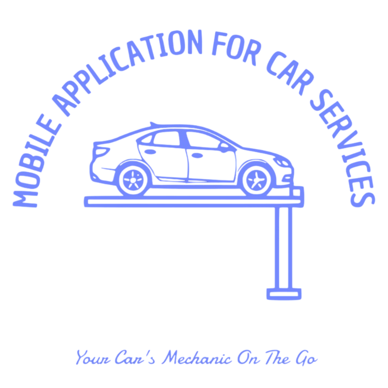

# Graduation Project Proposal

## Smart Auto — AI Car Help & Community App

  

| | |
|---|---|
| **Project name** | Smart Auto (Smart Auto Car) |
| **Type** | Mobile application (graduation project) |
| **Student** | *[Your full name]* |
| **Supervisor** | *[Supervisor name]* |
| **Institution** | *[University / faculty]* |
| **Date** | *[Month Year]* |

---

## 1. Simple summary

**Smart Auto** is a phone app for drivers. It helps people understand car problems using **artificial intelligence (AI)**, find **nearby car services** on a map, and **ask other drivers for help** through requests and chat. The app works on **Android and iOS** and uses a **cloud database** so data stays safe and synced.

This document is a **short proposal**: what we build, why it matters, how the system is organised, and which **tools** we use.

---

## 2. The problem (in plain words)

Many drivers feel stressed when something goes wrong with the car:

- They may not know **what the problem means**.
- **Garages** are not always easy to find or compare.
- **Other drivers** nearby could help, but there is no simple way to connect.

Smart Auto tries to **close these gaps** in one friendly mobile app.

---

## 3. Project goals

1. Let users **describe a problem** with **text, photo, or voice** and get a **clear AI explanation**.
2. Show **repair shops and services nearby** using **maps** and the phone’s **location**.
3. Let users **post a help request** (with optional price and location) so **other drivers** can respond.
4. Support **chat** between the person who needs help and the person who accepted the request.
5. Keep accounts and data **secure** with **login** and **rules** so each user only sees what they are allowed to see.

---

## 4. System analysis (easy English)

### 4.1 Who uses the system?

| Role | Short description |
|------|-------------------|
| **Guest** | Can see onboarding and sign-in screens; must register or log in to use main features. |
| **Registered user** | Same person can act as **requester** (needs help) or **driver/helper** (offers help), depending on what they do in the app. |
| **Requester** | Creates help requests, accepts a helper, and uses chat. |
| **Driver / helper** | Browses open requests, sends a response, and chats after acceptance. |

### 4.2 Main parts of the app (functions)

- **Onboarding** — short introduction screens for first-time users.
- **Account** — sign up, sign in, profile (name, phone, car, photo, location).
- **AI diagnosis** — upload or record; store files safely; send data to an AI service; save results in the database.
- **Home** — quick actions and overview.
- **Help requests** — create, list, and change status (open → accepted → completed).
- **Responses** — another user can respond to a request; the owner can accept one helper.
- **Chat** — one chat per request; text and images; live updates when new messages arrive.
- **Maps** — nearby car-related places (for example repair shops).

### 4.3 How the system is built (high level)

The app has **three layers** in simple terms:

1. **Phone app (client)** — built with **Flutter**. This is what the user sees and touches.
2. **Backend (cloud)** — **Supabase** provides:
   - **Login** (user accounts),
   - **Database** (tables for profiles, issues, requests, chat, messages),
   - **File storage** (profile photos, issue photos, voice, chat images),
   - **Realtime** (quick updates for messages and requests without refreshing everything).
3. **External services** — for example **Google Maps**, **AI (Gemini)** for text generation, and **device features** (camera, microphone, GPS).

Data does not sit only on the phone for important features: it is stored in the cloud so the user can use another device later and so chat and requests can work between two people.

### 4.4 Main data (database idea)

The graduation database design includes roughly:

| Area | Meaning in simple words |
|------|-------------------------|
| **profiles** | Extra information for each logged-in user (name, car, photo, map position). |
| **issues** | One row per AI diagnosis attempt (text, links to photos/voice, AI answer as JSON). |
| **requests** | A “help me” post (title, details, price, map point, status). |
| **request_responses** | A helper’s answer to a request; status pending or accepted. |
| **chats** | One chat linked to one request. |
| **messages** | Chat lines (text, image, who sent it, read time). |

**Safety rules (RLS)** in the database mean: users can only read or change rows they are allowed to — for example, your own profile, or a chat where you are a participant.

### 4.5 Diagrams

Formal **UML / ERD diagrams** (PlantUML) are in the folder:

`docs/plantuml/`

They include use case, activity, sequence, ERD, and block diagrams based on the same database script.

---

## 5. Tools and technologies used

### 5.1 Core

| Tool | What it is used for |
|------|---------------------|
| **Flutter** | One codebase for Android and iOS; user interface and app logic. |
| **Dart** | Programming language used with Flutter. |

### 5.2 App structure and navigation

| Tool | What it is used for |
|------|---------------------|
| **flutter_riverpod** | Organising state and sharing data across screens in a clean way. |
| **go_router** | Moving between screens (routes) and deep links. |

### 5.3 Backend and data

| Tool | What it is used for |
|------|---------------------|
| **Supabase** | Auth, PostgreSQL database, file storage, realtime subscriptions. |
| **supabase_flutter** | Connecting the Flutter app to Supabase. |

### 5.4 Maps and location

| Tool | What it is used for |
|------|---------------------|
| **google_maps_flutter** | Showing maps and markers. |
| **geolocator** | Reading the device location (with user permission). |

### 5.5 AI, media, and device

| Tool | What it is used for |
|------|---------------------|
| **google_generative_ai** | Calling Google’s Gemini API for AI answers. |
| **image_picker** | Choosing photos from gallery or camera. |
| **record** | Recording voice for diagnosis. |
| **speech_to_text** | Optional speech-to-text where used. |
| **permission_handler** | Asking the user for camera, mic, location permissions. |

### 5.6 UI and experience

| Tool | What it is used for |
|------|---------------------|
| **lottie** | Smooth onboarding and illustration animations. |
| **flutter_animate** | Extra motion and transitions on key screens. |
| **google_fonts** | Nice, readable typography. |
| **cached_network_image** | Loading profile and remote images efficiently. |

### 5.7 Other helpers

| Tool | What it is used for |
|------|---------------------|
| **shared_preferences** | Small settings on the device (for example theme). |
| **flutter_dotenv** | Loading API keys and URLs from environment files safely. |
| **http**, **url_launcher** | Network calls and opening links. |
| **uuid**, **intl**, **path_provider** | IDs, dates, and local file paths. |

### 5.8 Quality and packaging

| Tool | What it is used for |
|------|---------------------|
| **flutter_test**, **flutter_lints** | Tests and code style. |
| **flutter_launcher_icons** | App icon from the project logo. |

---

## 6. What we plan to deliver

- A **working mobile app** (demo on emulator or real phone).
- **Source code** with clear folders (features, services, theme).
- **Database script** (Supabase migrations) matching the design.
- **Documentation**: this proposal, diagram sources under `docs/plantuml/`, and short notes on how to run the app and configure Supabase.

---

## 7. Limits and honest notes

- The AI answer is a **helper**, not a replacement for a professional mechanic or official diagnosis.
- **Maps and AI** need **API keys** and sometimes billing accounts from the provider.
- The project focuses on a **clear MVP** (minimum viable product): core flows work end-to-end; extra polish can grow over time.

---

## 8. Closing

**Smart Auto** brings together **mobile development**, **cloud backend**, **maps**, and **AI** in one graduation project. The system is analysed around **real users** (requester and helper), **clear data tables**, and **safe access rules**, with tools chosen to match modern industry practice.

---

### How to turn this file into Word (.docx)

1. Open this file in **Microsoft Word** (File → Open → choose `Graduation_Project_Proposal.md`), then **Save As** → `.docx`.  
   *If the logo does not appear, use Insert → Pictures and add `assets/logo.png` from the project folder.*

2. Or install **Pandoc** and run in the project folder:  
   `pandoc docs/Graduation_Project_Proposal.md -o Smart_Auto_Proposal.docx`

---

*End of proposal draft — fill in names, dates, and institution where marked with asterisks.*
